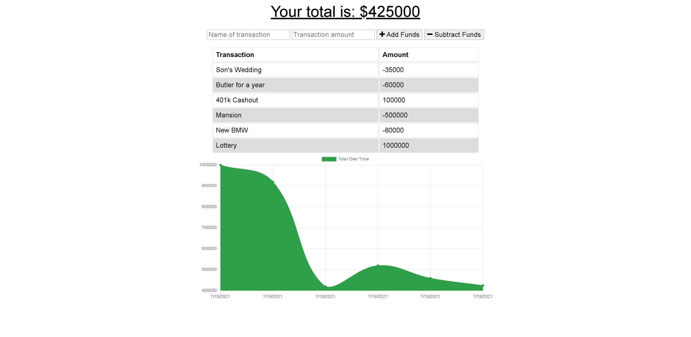

# Progressive Budget Tracker
## Description
This is an application that allows you to keep track of your money with ease! Just enter your deposits or expenses, and let the chart display your total over time. In a weird place with poor cell service? No need to worry! This application works offline, letting you worry about keeping track of your finances. Your offline data will be uploaded as soon as you come back online. 

## Getting Started:

### [Progressive Budget Tracker](https://progressive-budget-tracker-sjg.herokuapp.com/)

If you want to edit this app you must have a Github account, have downloaded Node.js, MongoDB, Robo 3T, and Visual Studio Code.

- Create a Github account here: [Github](https://github.com/)
- Download Visual Studio here: [Visual Studio](https://code.visualstudio.com/download/)
- Download MongoDB here: [MongoDB](https://www.mongodb.com/)
- Download Robo 3T here: [Robo 3T](https://robomongo.org/)
- Download Node: [Node.js](https://nodejs.org/en/)
- Repository link: [Progressive Budget Tracker Repo](https://github.com/scottgeleas/Progressive-Budget-Tracker)

 ### Authors:

 Scott Geleas

 ### Built With:

- Javascript
- Node.js
- Express.js
- MongoDB
- Mongoose
- Robo 3T
- Visual Studio Code

### Acknowledgements
Icons made by [Eucalyp](https://www.flaticon.com/authors/eucalyp) from [Flaticon](https://www.flaticon.com/)

 ### License: 
 

Copyright (c) [2021] [Scott Geleas]]

Permission is hereby granted, free of charge, to any person obtaining a copy
of this software and associated documentation files (the "Software"), to deal
in the Software without restriction, including without limitation the rights
to use, copy, modify, merge, publish, distribute, sublicense, and/or sell
copies of the Software, and to permit persons to whom the Software is
furnished to do so, subject to the following conditions:

The above copyright notice and this permission notice shall be included in all
copies or substantial portions of the Software.

THE SOFTWARE IS PROVIDED "AS IS", WITHOUT WARRANTY OF ANY KIND, EXPRESS OR
IMPLIED, INCLUDING BUT NOT LIMITED TO THE WARRANTIES OF MERCHANTABILITY,
FITNESS FOR A PARTICULAR PURPOSE AND NONINFRINGEMENT. IN NO EVENT SHALL THE
AUTHORS OR COPYRIGHT HOLDERS BE LIABLE FOR ANY CLAIM, DAMAGES OR OTHER
LIABILITY, WHETHER IN AN ACTION OF CONTRACT, TORT OR OTHERWISE, ARISING FROM,
OUT OF OR IN CONNECTION WITH THE SOFTWARE OR THE USE OR OTHER DEALINGS IN THE
SOFTWARE.
